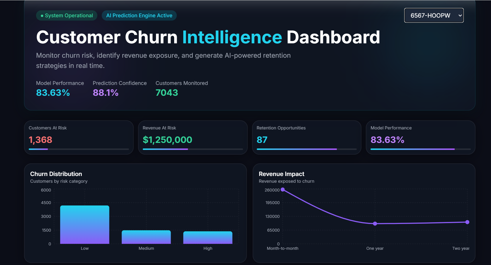
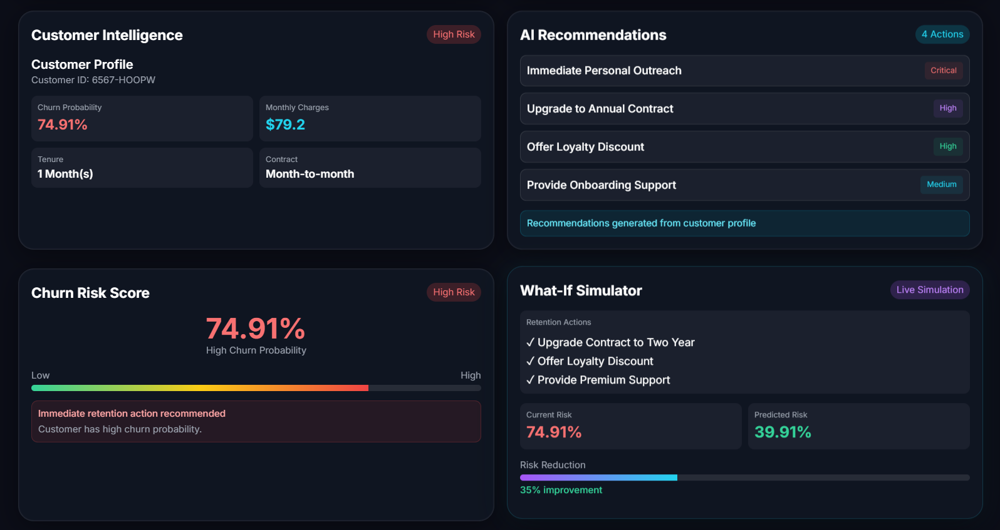
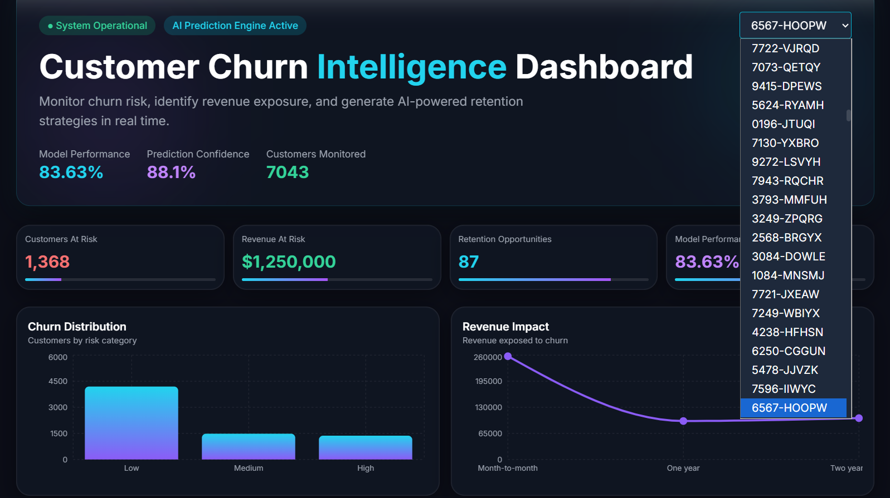

# Customer Churn Prediction and Retention Dashboard

Customer churn is a major challenge for businesses because losing existing customers directly impacts revenue and growth. Predicting customers who are likely to leave allows companies to take preventive actions and improve customer retention.
This project addresses this problem by combining Machine Learning with an interactive web dashboard to predict customer churn and provide actionable retention strategies.
The dashboard provides company-level analytics, customer-level insights, personalized retention recommendations, and a What-If Simulator that helps visualize how different retention strategies can reduce churn risk.
The application uses a Random Forest model for churn prediction, a Flask backend to serve predictions, and a React frontend to provide an interactive and user-friendly experience.
## Features
- Predicts customer churn using a trained Random Forest model.
- Displays company-level insights through KPIs and interactive visualizations.
- Provides detailed customer-level analysis, including churn probability and customer profile information.
- Generates personalized retention recommendations based on customer characteristics.
- Includes a What-If Simulator to demonstrate how different retention strategies can reduce churn risk.
- Visualizes key business metrics such as churn distribution, revenue at risk, and contract-based customer analysis.
 ## Technologies Used
### Frontend
- React
- Vite
- Tailwind CSS
- Recharts
### Backend
- Python
- Flask
### Machine Learning
- Scikit-learn
- Random Forest
### Database
- SQLite
### Data Processing
- Pandas
- NumPy
## Project Screenshots
### Company Dashboard

### Customer Dashboard

### Customer Selection

## Project Structure
```text
customer-churn-prediction-retention-dashboard/
├── frontend/              # React frontend
├── images/                # Dashboard screenshots
├── api.py                 # Flask API and endpoints
├── model_manager.py       # Model training and prediction
├── best_model.pkl         # Trained Random Forest model
├── preprocess.py          # Data preprocessing
├── dataset.csv            # Customer churn dataset     
├── database_setup.py      # Database setup
├── requirements.txt       # Project dependencies
└── README.md              # Project documentation
```
## System Architecture
```text
                        User
                          │
                          ▼
                 React Frontend
                          │
                HTTP Requests (REST API)
                          │
                          ▼
                   Flask Backend
                          │
          ┌───────────────┴────────────────┐
          │                                │
          ▼                                ▼
  Random Forest Model              SQLite Database
          │
          ▼
 Churn Prediction & Personalized
      Retention Recommendations
```
## Requirements
- Python 3.10+
- Node.js 18+
- npm
## How It Works
1. Customer data is loaded from the dataset and preprocessed.
2. Categorical features are encoded before training the model.
3. The Random Forest model predicts churn probability.
4. Flask serves predictions through REST APIs.
5. The React dashboard displays analytics and retention recommendations.
## Model Performance

| Metric | Score |
|--------|------:|
| Accuracy | 78.56% |
| Precision | 58.77% |
| Recall | 64.53% |
| F1-Score | 61.51% |
| ROC-AUC | 83.63% |
## Future Improvements
- Integrate Large Language Models (LLMs) to generate AI-powered personalized retention strategies instead of rule-based recommendations.
- Support multiple telecom datasets by automatically adapting the preprocessing pipeline to new datasets.
- Allow dynamic addition of new customer records through the dashboard.
- Automatically retrain the machine learning model as new customer data becomes available.
- Deploy the application to the cloud for real-time access.


